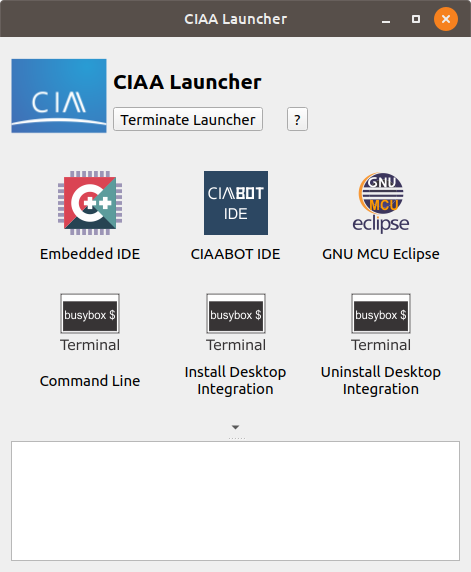
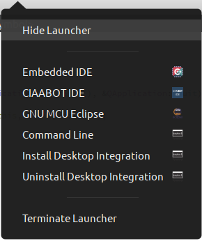

# Generic launcher for application suites

This program act as launcher for application suite or conjunction of applications with common entry point

  

### Characteristics

- Global environment configuration
- PATH addition
- Environment variable substitution on all entries
- Icon resource path addition
- Full configurable on all text
- Log window for command line interface with console output
- Integration with system tray

### Usage

The main configuration file is  `launcher-conf.json` and is search on:

- `<application binary directory>/applauncher/launcher-conf.json` if the application is build for windows or is linux AppImage
- `<application binary directory>/../share/applauncher/launcher-conf.json` if the application is stand alone linux or unix binary

The launcher configuration may contains this schema:

- **`mainIcon`**: Path to top icon application (can search on resource system via `res:<path>`)
- **`mainLabel`**: Text beside of main icon
- **`res`**: Array of string representing the search PATH of resources refers as `res:<resource name>`
- **`path`**: Array of string representing the additional search PATH perpended to the current process PATH (and all that child) 
- **`env`**: Object with pairs of key: value added or replaced in current process environment (and all that child)
- **`applications`**: Array of object applications contains this structure:
  - **`icon`**: Path to an icon (supporting png, svg, bmp, jpg or ico) for the launcher (can search on resource system via `res:<path>`)
  - **`text`**: Text to put beside icon
  - **`exec`**: Command line with arguments
  - **`work`**: Working directory for application

